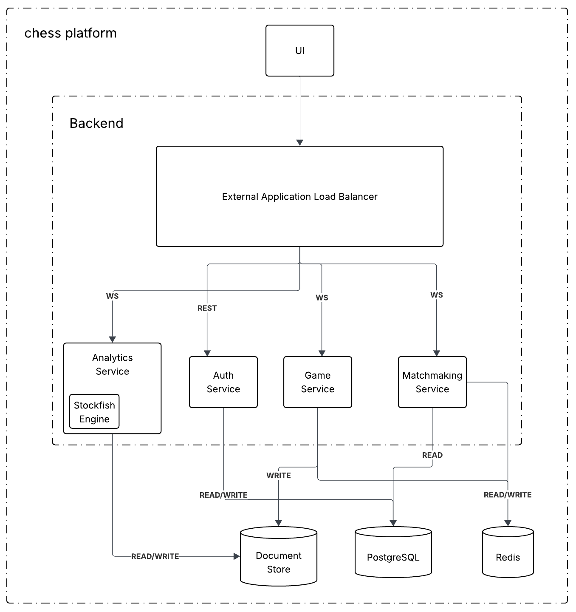

# ♟️ Online Chess Platform

> A web platform for playing, analyzing and tracking chess games online.

---

## 📖 Overview

Chess Platform is a full-stack, microservice-based application that lets users register, get matched against opponents by time control, play live games over WebSockets with server-authoritative move validation, and review their finished games with engine analysis. It is built on a **polyglot-persistence** stack — Postgres for transactional data, Redis for live game state, MongoDB for completed-game history — and is deployable to Google Cloud Platform with a single `terraform apply`.

### Features

- **Authentication** — sign up / log in with JWT-secured sessions
- **Matchmaking** — per-format queues (bullet / blitz / rapid / classical) with automatic pairing
- **Live gameplay** — real-time moves over WebSockets, with per-player clocks and server-side legality checks
- **Draw & resignation flow** — offer, accept, decline; resign at any time
- **ELO ratings** — automatic rating updates after every game and a full rating history per user
- **Engine analysis** — post-game move-by-move analysis powered by Stockfish
- **Statistics dashboard** — per-user record, rating curve, and recent games

### Architecture



[📄 Download PDF Version](assets/architecture.pdf)

**Routing.** A regional external HTTPS load balancer fans incoming requests out to the right Cloud Run service based on URL prefix:

| Path prefix                          | Service             | Responsibility                                          |
| ------------------------------------ | ------------------- | ------------------------------------------------------- |
| `/auth/*`, `/users/*`, `/players/*`  | `users-service`     | Auth, profile, ELO, rating history                      |
| `/match/*`                           | `matchmaker`        | Time-format queues, pairing, game creation              |
| `/game/*`                            | `game-service`      | Live game WebSocket, move validation, finalization      |
| `/analysis/*`                        | `analysis-service`  | Stockfish post-game analysis from stored move history   |
| _everything else_                    | `frontend`          | React SPA served by nginx                               |

**Data stores.**

| Store          | Used by                       | Stores                                                          |
| -------------- | ----------------------------- | --------------------------------------------------------------- |
| **PostgreSQL** | `users-service`, `game-service`, `matchmaker` | Users, games, rating history (transactional, relational)        |
| **Redis**      | `matchmaker`, `game-service`  | Matchmaking queues, live game state (board, turn, clocks, moves) |
| **MongoDB**    | `game-service`, `analysis-service` | Full move history of every finished game                        |

**Tech stack.**

- **Backend** — Python 3.13, FastAPI, SQLAlchemy + Alembic, `python-chess`, Stockfish
- **Frontend** — React + Vite, served behind nginx in production
- **Infra** — Docker, Terraform, GCP Cloud Run, Regional External HTTPS Load Balancer, Artifact Registry

---

## 📁 Repository structure

```
chess-platform/
├── backend/
│   ├── common/                  # shared SQLAlchemy models
│   ├── pyproject.toml           # single uv workspace for all backend services
│   └── services/
│       ├── api-gateway/         # local-only reverse proxy (replaced by GCP LB in prod)
│       ├── users-service/       # auth, profiles, ELO
│       ├── matchmaker/          # queues + pairing
│       ├── game-service/        # live game WebSocket
│       └── analysis-service/    # Stockfish analysis
├── frontend/                    # React + Vite SPA
├── terraform/                   # Cloud Run + LB + NEGs + SSL cert
├── docker-compose.yml           # local multi-service orchestration
└── docker-push.sh               # buildx → Artifact Registry (linux/amd64)
```

---

## ⚙️ Installation

### Prerequisites

| Tool                                                                                                | Needed for                                | Notes                                                       |
| --------------------------------------------------------------------------------------------------- | ----------------------------------------- | ----------------------------------------------------------- |
| [Docker](https://docs.docker.com/get-docker/)                                                       | Local runs, image builds                  | —                                                           |
| [uv](https://docs.astral.sh/uv/)                                                                    | Backend dev outside Docker                | Python 3.13 project manager                                 |
| [Node.js](https://nodejs.org/)                                                                      | Frontend dev outside Docker               | —                                                           |
| [Terraform](https://developer.hashicorp.com/terraform/install)                                      | GCP deployment                            | —                                                           |
| [gcloud CLI](https://cloud.google.com/sdk/docs/install)                                             | GCP deployment                            | Run `gcloud auth login` **and** `gcloud auth application-default login` (the second is required by Terraform) |
| [Stockfish](https://stockfishchess.org/)                                                            | Running `analysis-service` outside Docker | `brew install stockfish` / `apt install stockfish`. Set `STOCKFISH_PATH` in `backend/.env` if it isn't on `$PATH`. |

### Environment configuration

Each `.env_example` file in the repo lists the variables that need to be supplied. Copy them and fill in real values:

```bash
cp backend/.env_example   backend/.env
cp frontend/.env_example  frontend/.env
cp terraform/.env_example terraform/.env
```

`backend/.env` is the single source of truth for database URLs and secrets. `terraform/.env` sources it and re-exports the values as `TF_VAR_*`, so nothing needs to be duplicated.

---

## ▶️ Usage

### Local development

**Option A — Docker (recommended).** One command brings up every service:

```bash
docker compose up --build
```

The frontend will be available at <http://localhost:8080>.

**Option B — Run services natively.** One terminal per service:

```bash
# Backend
cd backend && uv sync
uv run -- fastapi dev services/api-gateway/app/main.py      --port 8000
uv run -- fastapi dev services/users-service/app/main.py    --port 8001
uv run -- fastapi dev services/matchmaker/app/main.py       --port 8002
uv run -- fastapi dev services/game-service/app/main.py     --port 8003
uv run -- fastapi dev services/analysis-service/app/main.py --port 8004

# Frontend
cd frontend && npm install && npm run dev
```

The Vite dev server runs at <http://localhost:5173>.

### Deploying to GCP

#### 1. One-time setup

```bash
source terraform/.env   # exports GCP_PROJECT_ID, GCP_REGION, and TF_VAR_*

gcloud services enable \
  run.googleapis.com \
  compute.googleapis.com \
  artifactregistry.googleapis.com \
  --project="$GCP_PROJECT_ID"

gcloud artifacts repositories create chess-platform-repo \
  --repository-format=docker \
  --location="$GCP_REGION" \
  --description="Docker repository for Chess Platform" \
  --project="$GCP_PROJECT_ID"

gcloud auth configure-docker "${GCP_REGION}-docker.pkg.dev"
```

The HTTPS load balancer in `terraform/lb.tf` expects `server.key` and `server.crt` at the repo root. Generate a self-signed pair for testing, or supply your own:

```bash
openssl req -x509 -newkey rsa:2048 -nodes \
  -keyout server.key -out server.crt -days 365 \
  -subj "/CN=chess-platform"
```

#### 2. Deploy

```bash
source terraform/.env   # exports GCP_PROJECT_ID, GCP_REGION, TF_VAR_*

# Build linux/amd64 images and push to Artifact Registry
./docker-push.sh

# Provision Cloud Run services + load balancer
cd terraform
terraform init
terraform apply
```

Once `terraform apply` finishes, the load balancer's public IP is printed as the `lb_ip_address` output. Open `https://<lb_ip_address>/` in your browser — you'll need to accept the self-signed certificate warning.

#### 3. Redeploying after code changes

```bash
./docker-push.sh    # rebuild & push new images
```

Cloud Run revisions are pinned to an image **digest** at creation, so pushing a new `:latest` tag does **not** update running services. Force a new revision for each service:

```bash
IMG_PREFIX="${GCP_REGION}-docker.pkg.dev/${GCP_PROJECT_ID}/chess-platform-repo"
for svc in users-service matchmaker game-service analysis-service frontend; do
  gcloud run deploy "${svc}" \
    --image="${IMG_PREFIX}/${svc}:latest" \
    --region="${GCP_REGION}" \
    --project="${GCP_PROJECT_ID}"
done
```

#### 4. Tearing down (to stop billing)

The load balancer's forwarding rules and reserved static IP bill 24/7 even when idle. To stop the meter, destroy everything Terraform created:

```bash
cd terraform
source .env
terraform destroy
```

Cloud Run itself only bills per request (idle = free), and the Artifact Registry repo costs pennies in storage — neither requires manual cleanup.
